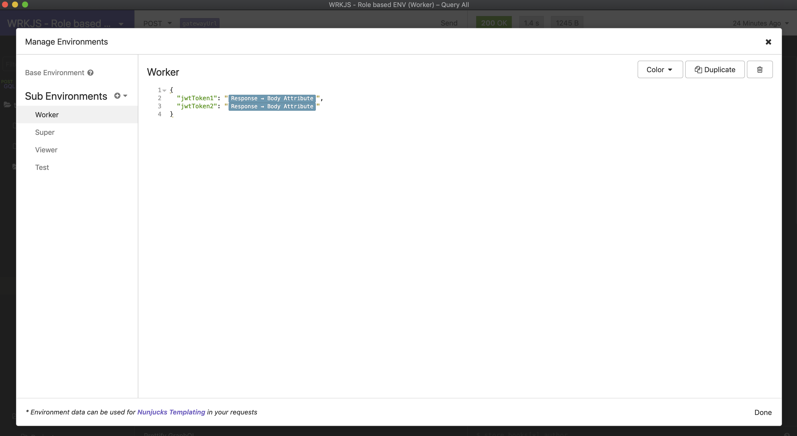
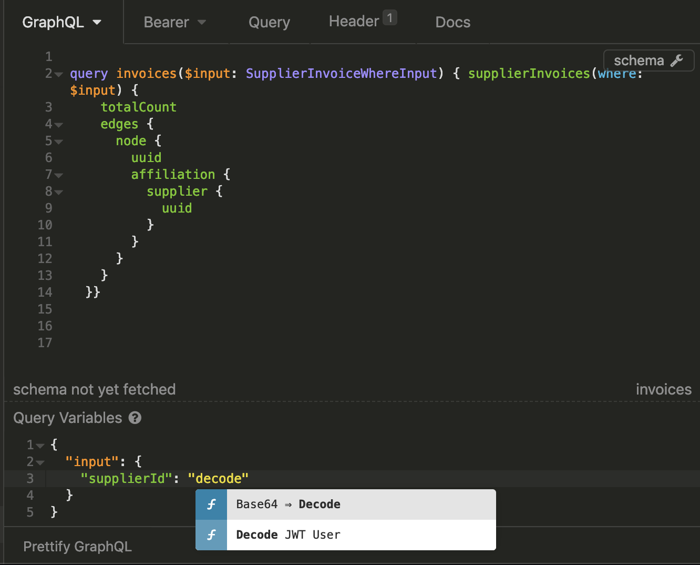
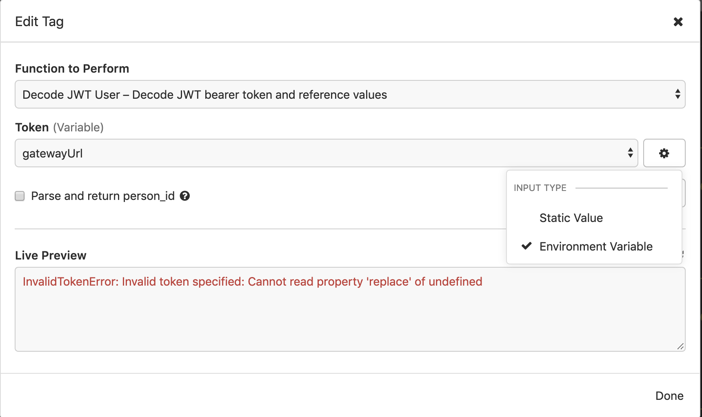
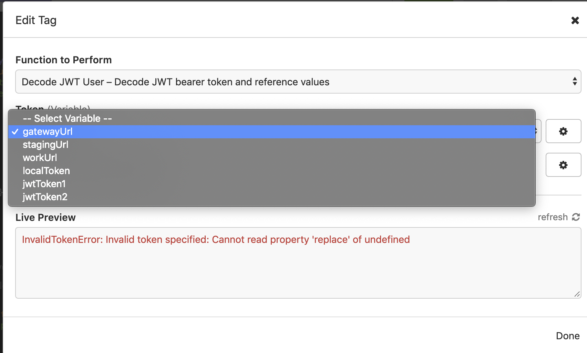
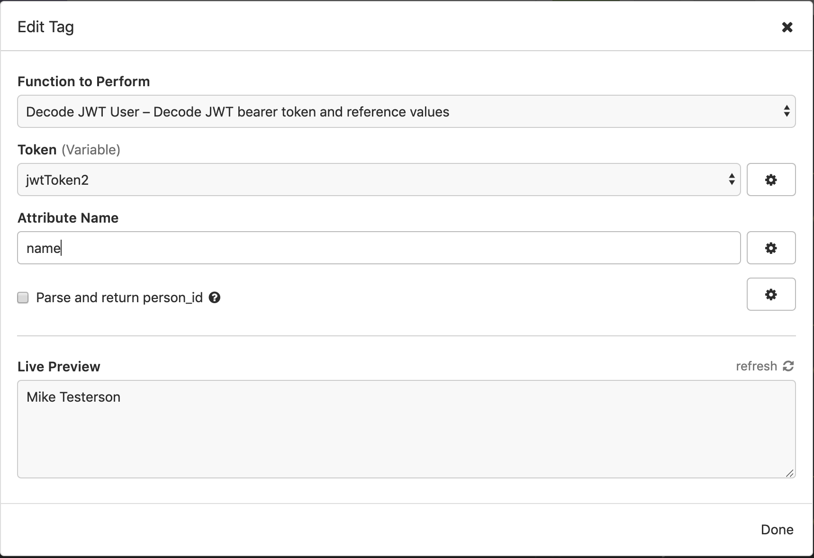
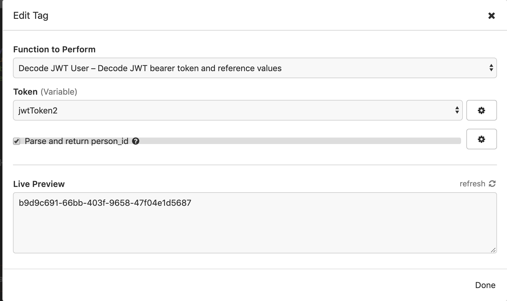
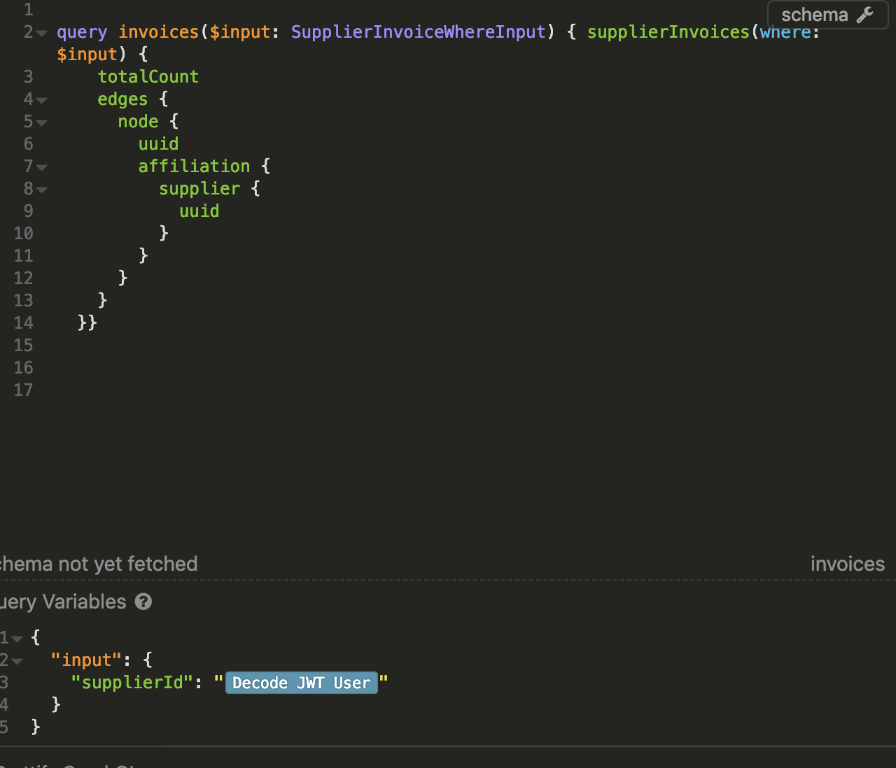

# Use decoded JWT in requests for Insomnia REST Client

This is a plugin for the [Insomnia REST client](https://insomnia.rest/) to decode a [JWT (JSON WebToken)](https://jwt.io/) and then reference a property from the decoded JWT in your request.

## Decoding Usage
1. Add the JWT that you want to decode as an environment variable.
   * You can dynamically set these using the `Response -> Body Attribute` [template](https://support.insomnia.rest/article/40-template-tags).
2. Select the `Decode JWT` template
3. Select the JWT you want to decode the the attributes you want returned
4. Leaving the attribute field blank will return the entire decoded JWT

## Example

 Set JWT tokens as environment variables
---

Use the decode JWT token template by pressing CTRL+Space.
---

Change the input type for the `Token` variable to `Environment Variable`
---

Select the JWT token you want to use
---

Enter the name of the attribute you want returned
---

Or select the checkbox to return the user id
---

Now you can reference this value anywhere you are able to use template tags
---

# License

    MIT License

    Copyright (c) 2018 Siebe Sysmans

    Permission is hereby granted, free of charge, to any person obtaining a copy
    of this software and associated documentation files (the "Software"), to deal
    in the Software without restriction, including without limitation the rights
    to use, copy, modify, merge, publish, distribute, sublicense, and/or sell
    copies of the Software, and to permit persons to whom the Software is
    furnished to do so, subject to the following conditions:

    The above copyright notice and this permission notice shall be included in all
    copies or substantial portions of the Software.

    THE SOFTWARE IS PROVIDED "AS IS", WITHOUT WARRANTY OF ANY KIND, EXPRESS OR
    IMPLIED, INCLUDING BUT NOT LIMITED TO THE WARRANTIES OF MERCHANTABILITY,
    FITNESS FOR A PARTICULAR PURPOSE AND NONINFRINGEMENT. IN NO EVENT SHALL THE
    AUTHORS OR COPYRIGHT HOLDERS BE LIABLE FOR ANY CLAIM, DAMAGES OR OTHER
    LIABILITY, WHETHER IN AN ACTION OF CONTRACT, TORT OR OTHERWISE, ARISING FROM,
    OUT OF OR IN CONNECTION WITH THE SOFTWARE OR THE USE OR OTHER DEALINGS IN THE
    SOFTWARE.
